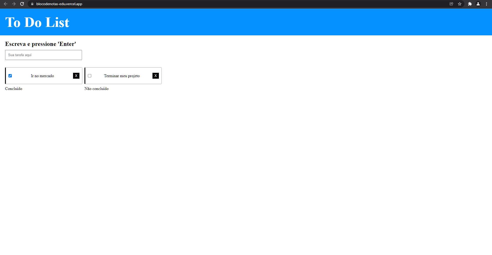

# To Do With Javascript
A simple and dynamic notebook in javascript

Um sistema dinamico de tarefas, ao clicar no botao 'Adicionar Tarefas', o javascript irá criar tag input para que possa escrever suas tarefas na mesma. As inputs dinâmicas já são customizadas com border, espaçamento, tamanho, placeholder.

.
